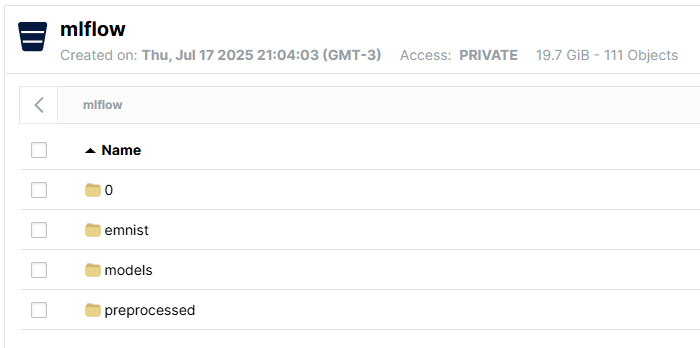
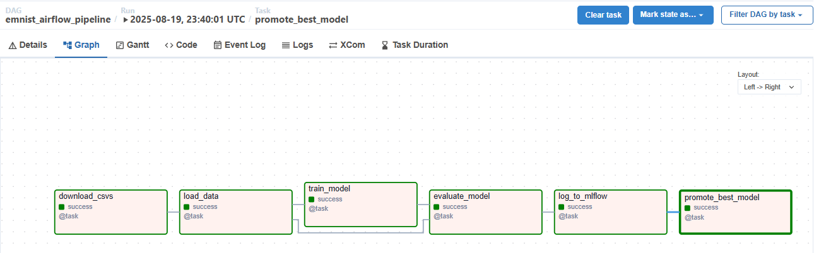
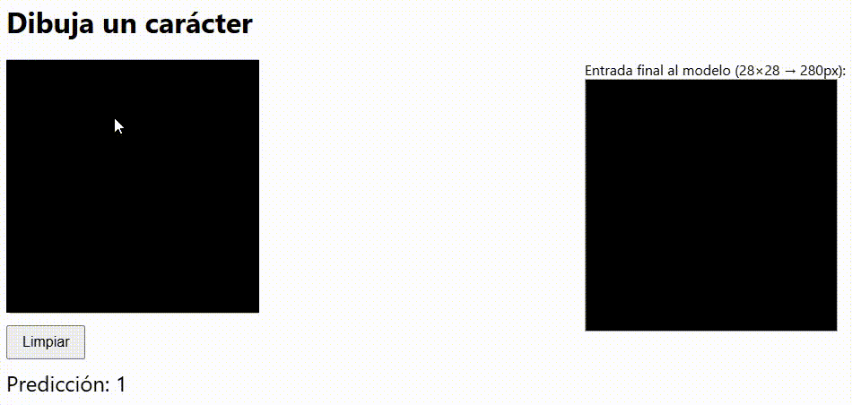

# Proyecto MLOps: Pipeline de Entrenamiento y Registro de EMNIST con Airflow y MLflow

Este proyecto implementa un pipeline completo de MLOps para el entrenamiento, evaluación y registro de modelos usando el dataset EMNIST Digits. Utiliza Docker, Airflow, MLflow para registrar experimentos y exponer modelos; MinIO (S3 compatible), PostgreSQL para orquestar y almacenar los experimentos y artefactos y Fast API para levantar un frontend HTML que haga consultas al modelo.

## ¿Qué hace el proyecto?

Se ha preparado el sistema para que todos los servicios sean desplegados automáticamente, encargándonos también de la descarga automática de archivos y datasets y otorgando los permisos necesarios para orquestar el sistema completo. Para ello solo es necesario ajustar los puertos del archivo `.env` y ejecutar el archivo `./init.sh` que están disponibles en el repositorio. El inicializador se encarga de:

- **Descargar automáticamente el dataset EMNIST** desde Kaggle y lo almacena en MinIO (S3).
- **Orquestar el pipeline de ML** con Airflow: descarga datos, entrena un modelo RandomForest, evalúa y registra el modelo en MLflow.
- **Almacenar experimentos y artefactos** en MLflow y MinIO.
- **Exponer interfaces web** para Airflow, MLflow y MinIO.
- **Exponer el modelo de mayor precisión** usando las capacidades de MLFlow.
- **Incluye una app de inferencia** (`draw_app`) para probar el modelo dibujando un número en el lienzo.

## Descripción de los servicios

- **Docker Compose:** Levanta todos los servicios necesarios de forma sencilla.
- **Airflow:** Orquestación del pipeline de ML.
- **MLflow:** Seguimiento de experimentos y registro de modelos.
- **MinIO:** Almacenamiento S3 para datasets y modelos.
- **PostgreSQL:** Backend para MLflow y Airflow.
- **Data Loader:** Descarga y carga automática de datos a MinIO.
- **MLflow Serve Model:** Sirve el modelo registrado para inferencia.
- **Data-loader:** Descarga el dataset EMNIST desde Kaggle y lo sube a MinIO automáticamente. En caso de detectar que no existe ningún modelo en producción, ejecuta automáticamente el DAGF. Este sistema se corre desde una imagen Debian Bullseye.
- **Draw App:** Interfaz web para probar el modelo.

## Estructura del pipeline

- `./airflow/dags/emnist_dag.py`: DAG principal que descarga datos, entrena el modelo, evalúa y registra en MLflow.
- `./Dockerfiles`: Dockerfiles personalizados para los servicios de MLflow y Airflow.
- `./scripts/bootstrap.sh`: Script para inicializar el bucket y cargar los datos en MinIO.
- `./init/init.sql`: Script para crear las bases de datos necesarias en PostgreSQL.
- `.env`: Variables de entorno para configuración de servicios. Si bien por seguridad no deberían encontrarse en el repositorio, se adjuntan para asegurar una ejecución fluida ya que este es un caso de prueba.
- `./scripts/serve_model.py`: Entrypoint del servicio que expone el modelo en producción. Selecciona la versión del modelo con el tag 'Production'.
- `./drawApp`: Archivos para correr la página web del frontend (los archivos HTML y js han sido completamente generados mediante IA generativa) y la API de transformación de imagen y consulta al modelo expuesto.

## Cómo correr el proyecto

1. Clonar el repositorio y entrar al directorio del proyecto

```bash
git clone <repo-url>
cd <repo-directory>
```

2. Configurar las variables de entorno

Editar el archivo `.env` si se necesita cambiar usuarios, contraseñas o puertos.

3. Inicializar las carpetas necesarias

```bash
./init.sh
```

Esto crea las carpetas de Airflow y levanta los servicios con Docker Compose.

4. Verificar que los servicios estén corriendo

```bash
docker-compose ps
```

o

```bash
docker compose ps
```

dependiendo de la version de docker-compose que tenga instalada.

Se deberían ver los siguientes servicios activos: postgres, minio, mlflow, airflow-webserver, airflow-scheduler, draw_app, mlflow_serve_model.

5. Acceder a las interfaces web (puertos en `.env`)

- MinIO: [http://localhost:{MINIO_UI_PORT}](http://localhost:{MINIO_UI_PORT}). En la página debería verse un bucket "mlflow" con los directorios que se pueden observar en la imagen:


- Airflow: [http://localhost:{AIRFLOW_WEB_PORT}](http://localhost:{AIRFLOW_WEB_PORT}). Debería observarse un DAG "emnist_airflow_pipeline" con por lo menos una ejecución exitosa ya lanzada. Su diagrama de bloques es como el que se muestra en la imagen:


- MLflow: [http://localhost:{MLFLOW_PORT}](http://localhost:{MLFLOW_PORT}). Debería existir una versión del modelo "EMNIST-Model" con el tag `stage=Production`. *Nota: el nombre del tag es uno generado propio, no el stage que proveía MLFlow y ya está deprecado*.

- Draw App: [http://localhost:{DRAW_APP_PORT}](http://localhost:{DRAW_APP_PORT}). En la ventana deberían verse dos lienzos: en el de la izquierda se puede dibujar y se hace una llamada al modelo de reconocimiento de dígitos una vez por segundo; en el de la derecha se ve el resultado de preprocesar la imagen del lienzo para asemejarla lo máximo posible al conjunto de entrenamiento (se aplica un filtro Gaussiano para suavizar los bordes y operaciones de rotación, y escala). El botón "Limpiar" resetea el canvas.


## Requisitos

- Docker y Docker Compose
- Acceso a Kaggle (para descargar EMNIST)
- Python (solo si quieres modificar los DAGs o scripts)

## Notas

- Los datos y modelos se almacenan en MinIO bajo el bucket mlflow.
- Los experimentos y métricas se visualizan en MLflow.
- El pipeline es reproducible y modular, se puede modificar el DAG para experimentar con otros modelos o datasets.
- La aplicación al completo ha sido probada en sistemas Linux, Mac y Windows y se brinda soporte para los tres.
